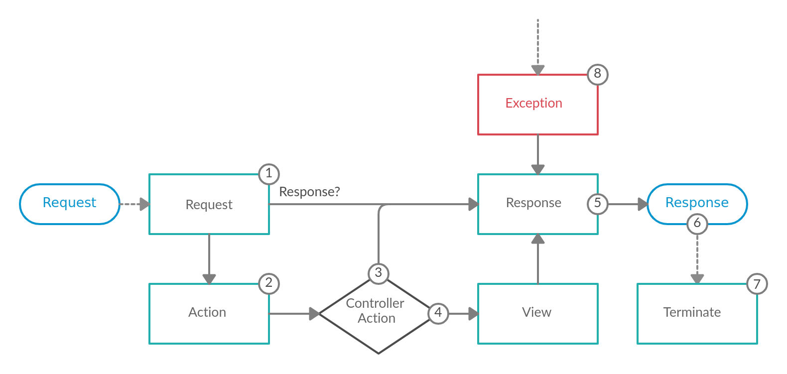

## Conventions

The [Why Athena?](./why_athena.md) page explained some of the reasoning behind the _why_ things are the way they are.
The framework also has a few conventions related to a more organizational point of view.

### Namespaces

The most obvious may be how each component is organized from a namespace perspective.
All component namespaces exist within a common top level `Athena` namespace.
Each component uses additional sub namespaces for organizational reasons, and as a means to have a place for common documentation.

### Aliases

Due to how Athena defines its namespaces, they can require a fair amount of typing due to the longer paths.
To help alleviate this, each component defines one or more top level aliases to reduce the number of characters needed to refer to a component's types.
For example, a controller needs to inherit from the `Athena::Framework::Controller` type, or `ATH::Controller` if using the [ATH](/framework/aliases#ATH) alias.
Similarly, `Athena::Routing::Annotations::Get` could be shortened to `ARTA::Get` via the [ARTA](/routing/aliases/#ARTA) alias.

In most cases, the component alias is three or four characters abbreviating the name of the component, always starting with an `A`.
Components that also define numerous annotations may have another alias dedicated to those annotations types.
This alias usually is the component alias with an `A`, short for annotations, suffix. E.g. [ATHA](/framework/aliases/#ATHA) or [ARTA](/routing/aliases/#ARTA).
Each component may also define additional aliases if needed, check the `Aliases` page in each component's API docs to see specifically what each component defines.

## Framework Architecture

At a high level the Athena Framework's job is *to interpret a request and create the appropriate response based on your application logic*. Conceptually this could be broken down into three steps:

1. Consume the request
2. Apply application logic to determine what the response should be
3. Return the response

Steps 1 and 3 are handled via Crystal's [HTTP::Server](https://crystal-lang.org/api/HTTP/Server.html), while step 2 is where Athena fits in.

### Powered By Events

Athena Framework is an event based framework, meaning it emits various events via the [Event Dispatcher](event_dispatcher.md) component during the life-cycle of a request. These events are listened on internally in order to handle each request; custom listeners on these events can also be registered. The flow of a request, and the related events that are dispatched, is depicted below in a visual format:

#### 1. Request Event

The very first event that is dispatched is the [ATH::Events::Request](/framework/Events/Request/index.html) event and can have a variety of listeners. The primary purpose of this event is to create an [ATH::Response](/framework/Response/) directly, or to add information to the requests' attributes; a simple key/value store tied to request instance accessible via [ATH::Request#attributes](/framework/Request/#Athena::Framework::Request#attributes).

In some cases the listener may have enough information to return an [ATH::Response](/framework/Response/) immediately. An example of this would be the [ATH::Listeners::CORS](/framework/Listeners/CORS/) listener. If enabled it is able to return a `CORS` preflight response even before routing is invoked.

WARNING: If an [ATH::Response](/framework/Response/) is returned at this stage, the flow of the request skips directly to the [response](#5-response-event) event. Future `Request` event listeners will not be invoked either.

Another use case for this event is populating additional data into the request's attributes; such as the locale or format of the request.

!!! example "Request event in the Athena Framework"
    This is the event that [ATH::Listeners::Routing](/framework/Listeners/Routing/) listens on to determine which [ATH::Controller](/framework/Controller/)/[ATH::Action](/framework/Action/) pair should handle the request.

    See [ATH::Controller](/framework/Controller/) for more details on routing.

#### 2. Action Event

The next event to be dispatched is the [ATH::Events::Action](/framework/Events/Action/) event, assuming a response was not already returned within the [request](#1-request-event) event. This event is dispatched after the related controller/action pair is determined, but before it is executed. This event is intended to be used when a listener requires information from the related [ATH::Action](/framework/Action/); such as reading custom annotations off of it via the [Config](config.md) component.

!!! example "Action event in the Athena Framework"
    This is the event that the [ATH::Listeners::ParamFetcher](/framework/Listeners/ParamFetcher) listens on to resolve request parameters such as [ATHA::QueryParam](/framework/Events/Annotations/QueryParam).

#### 3. Invoke the Controller Action

This next step is not an event, but a important concept within the Athena Framework nonetheless; executing the controller action related to the current request.

##### Argument Resolution

Before the controller action can be invoked, the arguments, if any, to pass to it need to be determined.
This is achieved via an [ATH::Controller::ArgumentResolverInterface](/framework/Controller/ArgumentResolverInterface/) that facilitates gathering all the arguments.
One or more [ATHR::Interface](/framework/Controller/ValueResolvers/Interface/) will then be used to resolve each specific argument's value.

Checkout [ATH::Controller::ValueResolvers](/framework/Controller/ValueResolvers/) for a summary of the built-in resolvers, and the order in which they are invoked.
Custom value resolves may be created & registered to extend this functionality.

TODO: An additional event could possibly be added after the arguments have been resolved, but before invoking the controller action.

##### Execute the Controller Action

The job of a controller action is to apply business/application logic to build a response for the related request; such as an HTML page, a JSON string, or anything else. How/what exactly this should be is up to the developer creating the application.

##### Handle the Response

The type of the value returned from the controller action determines what happens next. If the value is an [ATH::Response](/framework/Response/), then it is used as is, skipping directly to the [response](#5-response-event) event. However, if the value is _NOT_ an `ATH::Response`, then the [view](#4-view-event) is dispatched (since the framework _needs_ an `ATH::Response` in order to have something to send back to the client).

#### 4. View Event

The [ATH::Events::View](/framework/Events/View/) event is only dispatched when the controller action does _NOT_ return an [ATH::Response](/framework/Response/). The purpose of this event is to turn the controller action's return value into an `ATH::Response`.

An [ATH::View](/framework/View/) may be used to customize the response, e.g. setting a custom response status and/or adding additional headers; while keeping the controller action response data intact.

This event is intended to be used as a "View" layer; allowing scalar values/objects to be returned while listeners convert that value to the expected format (e.g. JSON, HTML, etc.). See the [negotiation](./negotiation.md) component for more information on this feature.

!!! example "View event in the Athena Framework"
    By default the framework will JSON serialize any non [ATH::Response](/framework/Response/) values.

#### 5. Response Event

The end goal of the Athena Framework is to return an [ATH::Response](/framework/Response/) back to the client; which might be created within the [request](#1-request-event) event, returned from the related controller action, or set within the [view](#4-view-event) event. Regardless of how the response was created, the [ATH::Events::Response](/framework/Events/Response/) event is dispatched directly after.

The intended use case for this event is to allow for modifying the response object in some manner. Common examples include: add/edit headers, add cookies, change/compress the response body.

#### 6. Return the Response

The raw [HTTP::Server::Response](https://crystal-lang.org/api/HTTP/Server/Response.html) object is never directly exposed. The reasoning for this is to allow listeners to mutate the response before it is returned as mentioned in the [response](#5-response-event) event section. If the raw response object was exposed, whenever any data is written to it it'll immediately be sent to the client and the status/headers will be locked; as mentioned in the Crystal API docs:

> The response `#status` and `#headers` must be configured before writing the response body. Once response output is written, changing the `#status` and `#headers` properties has no effect.

Each [ATH::Response](/framework/Response/) has a [ATH::Response::Writer](/framework/Response/Writer/) instance that determines _how_ the response should be written to the raw response's IO. By default it is written directly, but can be customized via the [response](#5-response-event) event, such as for compression.

#### 7. Terminate Event

The final event to be dispatched is the [ATH::Events::Terminate](/framework/Events/Terminate/) event. This is event is dispatched _after_ the response has been sent to the user.

The intended use case for this event is to perform some "heavy" action after the user has received the response; as to not affect the response time of the request. E.x. queuing up emails or logs to be sent/written after a successful request.

#### 8. Exception Handling

If an exception is raised at anytime while a request is being handled, the [ATH::Events::Exception](/framework/Events/Exception/) is dispatched. The purpose of this event is to convert the exception into an [ATH::Response](/framework/Response/). This is globally handled via an [ATH::ErrorRendererInterface](/framework/ErrorRendererInterface/), with the default being to JSON serialize the exception.

It is also possible to handle specific error states differently by registering multiple exception listeners to handle each case. An example of this could be to invoke some special logic only if the exception is of a specific type.

See the [error handling](../getting_started/README.md#error-handling) section in the getting started docs for more details on how error handling works in the Athena Framework.

## Further Reading

The Athena Framework also more tightly integrates the rest of the components into itself.
This section of the documentation includes sub-pages for each applicable component to describe how that component was integrated into the framework.
