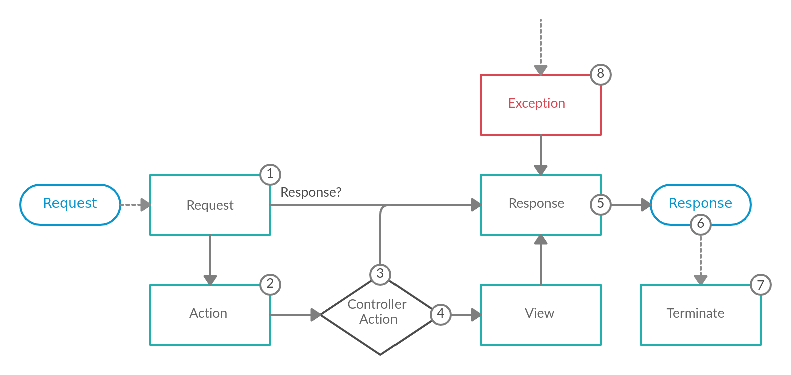

At a high level the Athena Framework's job is *to interpret a request and create the appropriate response based on your application logic*.
Conceptually this could be broken down into three steps:

1. Consume the request
2. Apply application logic to determine what the response should be
3. Return the response

Steps 1 and 3 are handled via Crystal's [HTTP::Server](https://crystal-lang.org/api/HTTP/Server.html), while step 2 is where the framework fits in.

## Events

Athena Framework is an event based framework, meaning it emits various events via the [Event Dispatcher](/EventDispatcher) component during the life-cycle of a request.
These events are listened on internally in order to handle each request; custom listeners on these events can also be registered.
The flow of a request, and the related events that are dispatched, is depicted below in a visual format:



### 1. Request Event

The very first event that is dispatched is the [ATH::Events::Request](/Framework/Events/Request) event and can have a variety of listeners. The primary purpose of this event is to create an [ATH::Response](/Framework/Response/) directly, or to add information to the requests' attributes; a simple key/value store tied to request instance accessible via [ATH::Request#attributes](/Framework/Request/#Athena::Framework::Request#attributes).

In some cases the listener may have enough information to return an [ATH::Response](/Framework/Response/) immediately. An example of this would be the [ATH::Listeners::CORS](/Framework/Listeners/CORS/) listener. If enabled it is able to return a `CORS` preflight response even before routing is invoked.

WARNING: If an [ATH::Response](/Framework/Response/) is returned at this stage, the flow of the request skips directly to the [response](#5-response-event) event. Future `Request` event listeners will not be invoked either.

Another use case for this event is populating additional data into the request's attributes; such as the locale or format of the request.

!!! example "Request event in the Athena Framework"
    This is the event that [ATH::Listeners::Routing](/Framework/Listeners/Routing/) listens on to determine which [ATH::Controller](/Framework/Controller/)/[ATH::Action](/Framework/Action/) pair should handle the request.

    See [ATH::Controller](/Framework/Controller/) for more details on routing.

### 2. Action Event

The next event to be dispatched is the [ATH::Events::Action](/Framework/Events/Action/) event, assuming a response was not already returned within the [request](#1-request-event) event. This event is dispatched after the related controller/action pair is determined, but before it is executed. This event is intended to be used when a listener requires information from the related [ATH::Action](/Framework/Action/); such as reading custom annotations off of it via the [Config](config.md) component.

!!! example "Action event in the Athena Framework"
    This is the event that the [ATH::Listeners::ParamFetcher](/Framework/Listeners/ParamFetcher) listens on to resolve request parameters such as [ATHA::QueryParam](/Framework/Events/Annotations/QueryParam).

### 3. Invoke the Controller Action

This next step is not an event, but a important concept within the Athena Framework nonetheless; executing the controller action related to the current request.

#### Argument Resolution

Before the controller action can be invoked, the arguments, if any, to pass to it need to be determined.
This is achieved via an [ATH::Controller::ArgumentResolverInterface](/Framework/Controller/ArgumentResolverInterface/) that facilitates gathering all the arguments.
One or more [ATHR::Interface](/Framework/Controller/ValueResolvers/Interface/) will then be used to resolve each specific argument's value.

Checkout [ATH::Controller::ValueResolvers](/Framework/Controller/ValueResolvers/) for a summary of the built-in resolvers, and the order in which they are invoked.
Custom value resolves may be created & registered to extend this functionality.

TODO: An additional event could possibly be added after the arguments have been resolved, but before invoking the controller action.

#### Execute the Controller Action

The job of a controller action is to apply business/application logic to build a response for the related request; such as an HTML page, a JSON string, or anything else. How/what exactly this should be is up to the developer creating the application.

#### Handle the Response

The type of the value returned from the controller action determines what happens next. If the value is an [ATH::Response](/Framework/Response/), then it is used as is, skipping directly to the [response](#5-response-event) event. However, if the value is _NOT_ an `ATH::Response`, then the [view](#4-view-event) is dispatched (since the framework _needs_ an `ATH::Response` in order to have something to send back to the client).

### 4. View Event

The [ATH::Events::View](/Framework/Events/View/) event is only dispatched when the controller action does _NOT_ return an [ATH::Response](/Framework/Response/). The purpose of this event is to turn the controller action's return value into an `ATH::Response`.

An [ATH::View](/Framework/View/) may be used to customize the response, e.g. setting a custom response status and/or adding additional headers; while keeping the controller action response data intact.

This event is intended to be used as a "View" layer; allowing scalar values/objects to be returned while listeners convert that value to the expected format (e.g. JSON, HTML, etc.). See the [negotiation](./negotiation.md) component for more information on this feature.

!!! example "View event in the Athena Framework"
    By default the framework will JSON serialize any non [ATH::Response](/Framework/Response/) values.

### 5. Response Event

The end goal of the Athena Framework is to return an [ATH::Response](/Framework/Response/) back to the client; which might be created within the [request](#1-request-event) event, returned from the related controller action, or set within the [view](#4-view-event) event. Regardless of how the response was created, the [ATH::Events::Response](/Framework/Events/Response/) event is dispatched directly after.

The intended use case for this event is to allow for modifying the response object in some manner. Common examples include: add/edit headers, add cookies, change/compress the response body.

### 6. Return the Response

The raw [HTTP::Server::Response](https://crystal-lang.org/api/HTTP/Server/Response.html) object is never directly exposed. The reasoning for this is to allow listeners to mutate the response before it is returned as mentioned in the [response](#5-response-event) event section. If the raw response object was exposed, whenever any data is written to it it'll immediately be sent to the client and the status/headers will be locked; as mentioned in the Crystal API docs:

> The response `#status` and `#headers` must be configured before writing the response body. Once response output is written, changing the `#status` and `#headers` properties has no effect.

Each [ATH::Response](/Framework/Response/) has a [ATH::Response::Writer](/Framework/Response/Writer/) instance that determines _how_ the response should be written to the raw response's IO. By default it is written directly, but can be customized via the [response](#5-response-event) event, such as for compression.

### 7. Terminate Event

The final event to be dispatched is the [ATH::Events::Terminate](/Framework/Events/Terminate/) event. This is event is dispatched _after_ the response has been sent to the user.

The intended use case for this event is to perform some "heavy" action after the user has received the response; as to not affect the response time of the request. E.x. queuing up emails or logs to be sent/written after a successful request.

### 8. Exception Handling

If an exception is raised at anytime while a request is being handled, the [ATH::Events::Exception](/Framework/Events/Exception/) is dispatched. The purpose of this event is to convert the exception into an [ATH::Response](/Framework/Response/). This is globally handled via an [ATH::ErrorRendererInterface](/Framework/ErrorRendererInterface/), with the default being to JSON serialize the exception.

It is also possible to handle specific error states differently by registering multiple exception listeners to handle each case. An example of this could be to invoke some special logic only if the exception is of a specific type.

## Event Listeners

Unlike other frameworks, Athena Framework leverages event based middleware instead of a pipeline based approach.
The primary use case for event listeners is to tap into the life-cycle of the request, such as adding common headers, setting state extracted from the request, or whatever else the application requires.
These can be created by creating a type annotated with [ADI::Register](/DependencyInjection/Register) and including [AED::EventListenerInterface](/EventDispatcher/EventListenerInterface).
From here, 1 or more methods may be defined that has the [AEDA::AsEventListener](/EventDispatcher/Annotations/AsEventListener) annotation applied to it.

```crystal
require "athena"

@[ADI::Register]
class CustomListener
  include AED::EventListenerInterface

  @[AEDA::AsEventListener]
  def on_response(event : ATH::Events::Response) : Nil
    event.response.headers["FOO"] = "BAR"
  end
end

class ExampleController < ATH::Controller
  get "/" do
    "Hello World"
  end
end

ATH.run

# GET / # => Hello World (with `FOO => BAR` header)
```

Similarly, the framework itself is implemented using the same features available to the users.
Thus it is very easy to run specific listeners before/after the built-in ones if so desired.

TIP: Check out the `debug:event-dispatcher` [command](./commands.md) for an easy way to see all the listeners and the order in which they are executed.

TIP: A single event listener may listen on multiple events. Instance variables can be used to share state between the events.

WARNING: The "type" of the listener has an effect on its behavior!
When a `struct` service is retrieved or injected into a type, it will be a copy of the one in the SC (passed by value).
This means that changes made to it in one type, will *NOT* be reflected in other types.
A `class` service on the other hand will be a reference to the one in the SC. This allows it to share state between services.

## Custom Events

Using events can be a helpful design pattern to allow for code that is easily extensible.
An event represents something _has happened_ where nobody may be interested in it, or in other words there may be zero or more listeners listening on a given event.
A more concrete example is an event could be dispatched after some core piece of application logic.
From here it would be easy to tap into when this logic is executed to perform some other follow up action, without increasing the complexity of the type that performs the core action.
This also adheres to the [single responsibility](../why_athena.md#single-responsibility) principle.

```crystal
require "athena"

# Define a custom event
class MyEvent < AED::Event
  property value : Int32

  def initialize(@value : Int32); end
end

# Define a listener that listens our the custom event.
@[ADI::Register]
class CustomEventListener
  include AED::EventListenerInterface

  @[AEDA::AsEventListener]
  def call(event : MyEvent) : Nil
    event.value *= 10
  end
end

# Register a controller as a service,
# injecting the event dispatcher to handle processing our value.
@[ADI::Register]
class ExampleController < ATH::Controller
  def initialize(@event_dispatcher : AED::EventDispatcherInterface); end

  @[ARTA::Get("/{value}")]
  def get_value(value : Int32) : Int32
    event = MyEvent.new value

    @event_dispatcher.dispatch event

    event.value
  end
end

ATH.run

# GET /10 # => 100
```
