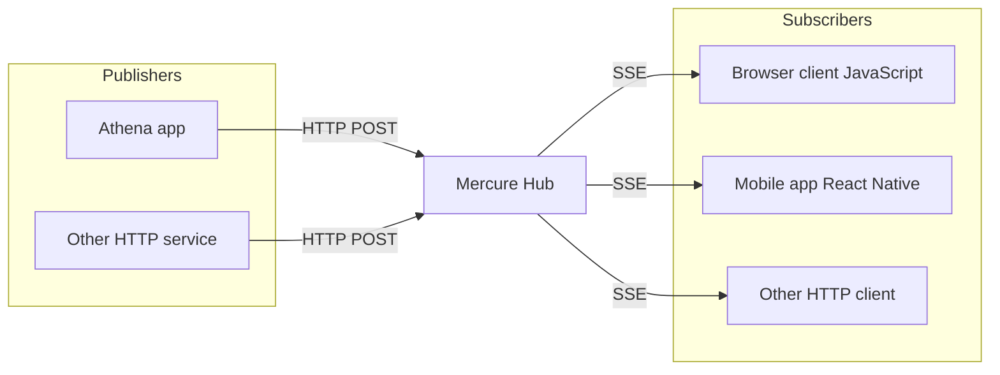
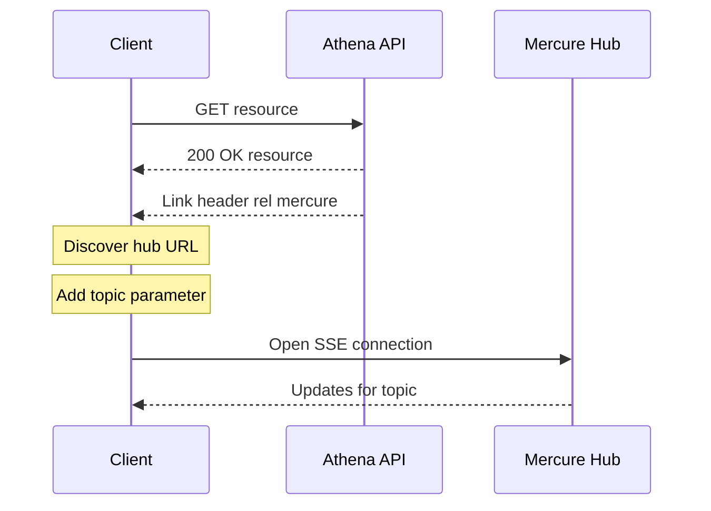

The `Athena::Mercure` component allows easily pushing updates to web browsers and other HTTP clients using the [Mercure protocol](https://mercure.rocks/docs/mercure).
Because it is built on top of [Server-Sent Events (SSE)](https://developer.mozilla.org/en-US/docs/Web/API/Server-sent_events), Mercure is supported out of the box in modern browsers.

Mercure comes with an authorization mechanism, automatic reconnection in case of network issues with retrieving of lost updates, a presence API, "connection-less" push for smartphones and auto-discoverability (a supported client can automatically discover and subscribe to updates of a given resource thanks to a specific HTTP header).

Unlike the Crystal stdlib's [HTP::WebSocketHandler](https://crystal-lang.org/api/HTTP/WebSocketHandler.html), Mercure relies on a centralized hub to manage the persistent SSE connections with the client(s) as opposed to connecting directly to the Crystal HTTP server.



Ultimately this makes the interactions/usage of it simpler since the majority of the complex parts are abstracted away.

## Installation

First, install the component by adding the following to your `shard.yml`, then running `shards install`:

```yaml
dependencies:
  athena-mercure:
    github: athena-framework/mercure
    version: ~> 0.1.0
```

### Setup

Because the Mercure Hub is a separate process from the Athena HTTP server, it does mean you have to [install](https://mercure.rocks/docs/hub/install) a Mercure hub by yourself.
For production usages, an official and open source (AGPL) hub based on the Caddy web server can be downloaded as a static binary from [Mercure.rocks](https://mercure.rocks).
A Docker image, a Helm chart for Kubernetes and a managed, High Availability Hub are also provided.

Locally, it's easiest to run the Hub via [docker compose](https://docs.docker.com/compose).
A minimal development compose file would look like:

```yaml
services:
  mercure:
    image: dunglas/mercure
    restart: unless-stopped
    environment:
      SERVER_NAME: ':80' # Disable HTTPS for local dev
      MERCURE_PUBLISHER_JWT_KEY: '!ChangeThisMercureHubJWTSecretKey!'
      MERCURE_SUBSCRIBER_JWT_KEY: '!ChangeThisMercureHubJWTSecretKey!'
      MERCURE_EXTRA_DIRECTIVES: |
        cors_origins http://localhost:3000 # Allow Athena Server
    command: /usr/bin/caddy run --config /etc/caddy/dev.Caddyfile # Enable dev mode
    ports:
      - '80:80'
    volumes:
      - mercure_data:/data
      - mercure_config:/config

volumes:
  mercure_data:
  mercure_config:
```

## Usage

Now that the Mercure hub is running, we can use it to publish updates, and subscribe to receive those updates on the client side.

### Publishing

In order to publish an update, a [AMC::Hub][] instance is required.
This type expects to be provided a URL to the Mercure Hub that updates should be sent to, and an [AMC::TokenProvider::Interface][] instance.
The token provider is responsible for returning a JWT token used to authenticate the request sent to the Mercure Hub.
Most commonly this'll be generated using a static secret key via the [Crystal JWT](https://github.com/crystal-community/jwt) shard.

An [AMC::Update][] instance should then be instantiated that represents the update to publish, and provided to the `#publish` method of the hub instance.
A complete example of this flow is as follows:

```crystal
token_factory = AMC::TokenFactory::JWT.new ENV["MERCURE_JWT_SECRET"]

# Use `*` to give the created JWT access to all topics.
token_provider = AMC::TokenProvider::Factory.new token_factory, publish: ["*"]

hub = AMC::Hub.new ENV["MERCURE_URL"], token_provider, token_factory

update = AMC::Update.new(
  "https://example.com/my-topic",
  {message: "Hello world @ #{Time.local}!"}.to_json
)

hub.publish update # => urn:uuid:e1ee88e2-532a-4d6f-ba70-f0f8bd584022
```

Multiple hubs can be used and accessed by name via a [AMC::Hub::Registry][].

### Subscribing

Updates can be subscribed to on any platform that supports [Server-Sent Events](https://developer.mozilla.org/en-US/docs/Web/API/Server-sent_events).
For example via JS:

```html
<!doctype html>
<html>
  <body>
    <script type="application/javascript">
      const url = new URL("http://localhost/.well-known/mercure");
      url.searchParams.append("topic", "https://example.com/my-topic");

      const eventSource = new EventSource(url);

      console.log("listening...");
      eventSource.onmessage = (e) => console.log(e);
    </script>

    <h2>Mercure Testing</h2>
  </body>
</html>
```
This code would log each received update to the console.
Be sure to call `eventSource.close()` when no longer needed to avoid a resource leak.

### Authorization

Mercure allows dispatching updates to only authorized clients.
To do so, mark an [AMC::Update][] as `private` via the third constructor argument, the `private` named argument:

```crystal
AMC::Update.new(
  "https://example.com/books/1",
  {status: "OutOfStock"}.to_json,
  private: true
)
```

To subscribe to private updates, subscribers must provide to the Hub a JWT containing a topic selector matching by the topic of the update.
The preferred way of providing the JWT in a browser context is via a cookie.

WARNING: To use the cookies, the Athena app and the Mercure Hub must be served from the same domain (can be different sub-domains).

The Mercure component provides [AMC::Authorization][] that can handle generating/setting the cookie given a request/response.
Cookies set by this helper class are automatically passed by the browser to the Mercure hub if the `withCredentials` attribute of `EventSource` is set to `true`:

```js
const eventSource = new EventSource(url, { withCredentials: true });
```

### Discovery

Mercure comes with the ability to automatically discover the hub via a [Link](https://developer.mozilla.org/en-US/docs/Web/HTTP/Reference/Headers/Link) header.



The header may be added using the [AMC::Discovery][] type.
The client would then be able to extract the hub URL from the `Link` header to be able to subscribe to updates related to that resource:

```js
// Fetch the original resource served by the Athena web API
fetch('/books/1') // Has Link: <https://hub.example.com/.well-known/mercure>; rel="mercure"
  .then(response => {
    // Extract the hub URL from the Link header
    const hubUrl = response.headers.get('Link').match(/<([^>]+)>;\s+rel=(?:mercure|"[^"]*mercure[^"]*")/)[1];

    // Append the topic(s) to subscribe as query parameter
    const hub = new URL(hubUrl, window.origin);
    hub.searchParams.append('topic', 'https://example.com/books/{id}');

    // Subscribe to updates
    const eventSource = new EventSource(hub);
    eventSource.onmessage = event => console.log(event.data);
  });
```

### Testing

The Mercure component comes with some helper types for testing code that publishes updates, without actually sending the update.
See [AMC::Spec][] for more information.

```crystal
require "athena-mercure/spec"

hub = AMC::Spec::MockHub.new("https://foo.com", AMC::TokenProvider::Static.new("JWT")) { "id" }

# ...
```
