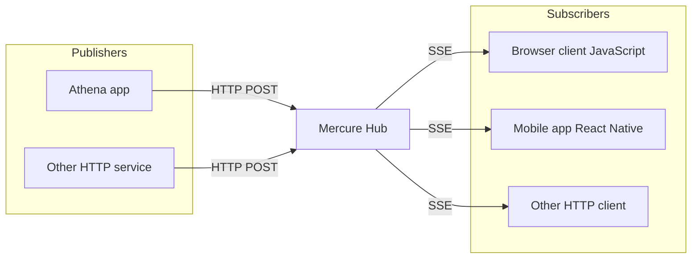

The `Athena::Mercure` component allows easily pushing updates to web browsers and other HTTP clients using the [Mercure protocol](https://mercure.rocks/docs/mercure).
Because it is built on top of [Server-Sent Events (SSE)](https://developer.mozilla.org/en-US/docs/Web/API/Server-sent_events), Mercure is supported out of the box in modern browsers.

Mercure comes with an authorization mechanism, automatic reconnection in case of network issues with retrieving of lost updates, a presence API, "connection-less" push for smartphones and auto-discoverability (a supported client can automatically discover and subscribe to updates of a given resource thanks to a specific HTTP header).

Unlike the Crystal stdlib's [HTP::WebSocketHandler](https://crystal-lang.org/api/HTTP/WebSocketHandler.html), Mercure relies on a centralized hub to manage the persistent SSE connections with the client(s) as opposed to connecting directly to the Crystal HTTP server.


```mermaid
flowchart LR

  %% Publishers
  subgraph Publishers
    P1["Athena app"]
    P2["Other HTTP service"]
  end

  %% Mercure Hub
  H["Mercure Hub"]

  %% Subscribers
  subgraph Subscribers
    S1["Browser client JavaScript"]
    S2["Mobile app React Native"]
    S3["Other HTTP client"]
  end

  %% Flows from publishers to hub
  P1 -->|HTTP POST| H
  P2 -->|HTTP POST| H

  %% Flows from hub to subscribers
  H -->|SSE| S1
  H -->|SSE| S2
  H -->|SSE| S3
```

Ultimately this makes the interactions/usage of it simpler since the majority of the complex parts are abstracted away.

## Installation

First, install the component by adding the following to your `shard.yml`, then running `shards install`:

```yaml
dependencies:
  athena-mercure:
    github: athena-framework/mercure
    version: ~> 0.1.0
```

### Setup

Because the Mercure Hub is a separate process from the Athena HTTP server, it does mean you have to [install](https://mercure.rocks/docs/hub/install) a Mercure hub by yourself.
For production usages, an official and open source (AGPL) hub based on the Caddy web server can be downloaded as a static binary from Mercure.rocks.
A Docker image, a Helm chart for Kubernetes and a managed, High Availability Hub are also provided.

Locally, it's easiest to run the Hub via [docker compose](https://docs.docker.com/compose).
A minimal development compose file would look like:

```yaml
services:
  mercure:
    image: dunglas/mercure
    restart: unless-stopped
    environment:
      SERVER_NAME: ':80' # Disable HTTPS for local dev
      MERCURE_PUBLISHER_JWT_KEY: '!ChangeThisMercureHubJWTSecretKey!'
      MERCURE_SUBSCRIBER_JWT_KEY: '!ChangeThisMercureHubJWTSecretKey!'
      MERCURE_EXTRA_DIRECTIVES: |
        cors_origins http://localhost:8080
    command: /usr/bin/caddy run --config /etc/caddy/dev.Caddyfile # Enable dev mode
    ports:
      - '80:80'
    volumes:
      - mercure_data:/data
      - mercure_config:/config

volumes:
  mercure_data:
  mercure_config:
```

## Usage

TODO: Write me
